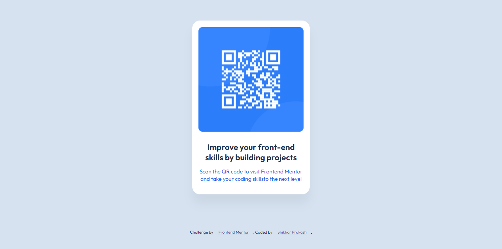
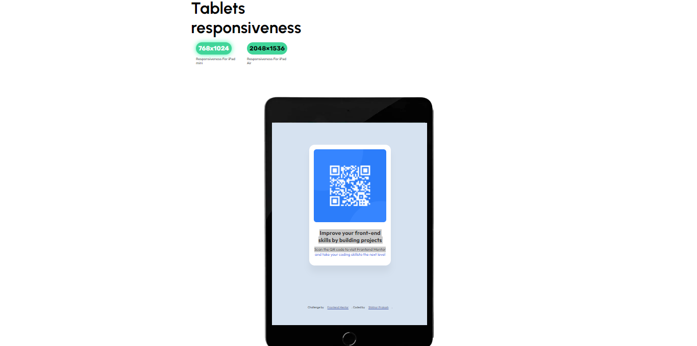

# QR code components

This is a textual overview to the [QR code component challenge on Frontend Mentor](https://www.frontendmentor.io/challenges/qr-code-component-iux_sIO_H). Frontend Mentor challenge is a great way to improve frontend skills by building realistic projects.

## Table of contents

- [Overview](#overview)
  - [Screenshots](#screenshots)
- [My process](#my-process)
  - [Built with](#built-with)
  - [What I learned](#what-i-learned)
  - [Front-end Style Guide](#front-end-style-guide)
  - [Layout](#layout)
  - [Colors](#colors)
  - [Code Snippets](#code-snippets)
  - [Continued development](#continued-development)
- [Lets Connect](#lets-connect)

## Overview

### Screenshots

- Desktop screen
  responsiveness

  - Standard Size (1280x720)



- Tablet
  responsiveness

  - Responsiveness for iPad Mini (768x1024)



- Mobile
  responsiveness

  - Responsiveness for Samsung Galaxy S10+, A41+, A22+, A33+ (412 x 869)


- Responsiveness for Samsung Galaxy S10, A41, A22, A33 (360 x 760)


- Responsiveness for Samsung Galaxy S9, Samsung Galaxy S9+ (360 x 740)


- Responsiveness for iPhone 14 Pro Max (414 x 896)


- Responsiveness for iPhone 11, 12, 13, XS (375 x 812)


### Links

- Solution URL: [Add solution URL here](https://your-solution-url.com)
- Live Site URL: [Add live site URL here](https://your-live-site-url.com)

## My process

The best possible way to build any webpage is to :

- First do a rough sketch of your webpage (landing page).
- Then find all the necessary resources which will help in building the website.
- Start building the skelton of the webpage which is :

  1. Start working with HTML
  2. Then start to add CSS one-by-one to One element at a time (USE THE TOP-DOWN APPROACH)
  3. Then start customizing the CSS with any custom properties of own.
  4. Open it with a live server and do the required customizing of the webpage.
  5. Add responsiveness to the website
     use breakpoints and media queries.
  6. After completing the website , deploy it either on Github as an repository or deploy it on Netlify so that you can showcase your work to public.

### Built with

- Semantic HTML5 markup
- CSS custom properties
- CSS Grid
- Mobile-first workflow
- [Google Fonts](https://fonts.google.com/?query=outfit/) - For text styling

### Font

- Family: [Outfit](https://fonts.google.com/specimen/Outfit)
- Weights: 400, 700

### What I learned

Some of the major learnings while working through this project :

- Learned how to find different fonts and how to push it into our project.
- Get to know few new CSS Properties.
- Learned on the positioning of over card just right at center of our page.
- Learned about the Responsiveness behaviour of the website on different dimensions and how to manage those changes.
- Get to know about different @media queries and breakpoints used in building a professional website.

# Front-end Style Guide

## Layout

The designs were created to the following widths:

- Mobile: 375px
- Desktop: 1440px

## Colors

- White: hsl(0, 0%, 100%)
- Light gray: hsl(212, 45%, 89%)
- Grayish blue: hsl(220, 15%, 55%)
- Dark blue: hsl(218, 44%, 22%)

## Code Snippets

### For some code snippets, see below:

```html
<h1>Some HTML code I'm proud of</h1>
<a
  class="github"
  href="https://github.com/ShikharPrakash071"
  target="_blank"
  >Shikhar Prakash</a
```

```css
.proud-of-this-css {
  font-size: 1.375rem;
  line-height: 1.275;
  margin-top: 1.1em;
  color: hsl(218, 44%, 22%);
}
```

### Continued development

I will further make developments in the project such as :

- Add a h1 tag at the top of the scan card.
- Then will add an input section just above the image of the scanner.
- Atlast will a button at the bottom of the card (Generate QR Code).

## Let's Connect

- LinkedIn - [Shikhar Prakash](https://www.linkedin.com/in/shikhar-prakash-441388200/)
- Frontend Mentor - [ShikharPrakash071](https://www.frontendmentor.io/profile/ShikharPrakash071)
- Twitter - [@Prakash10Shikhar](https://www.twitter.com/Prakash10Shikhar)
